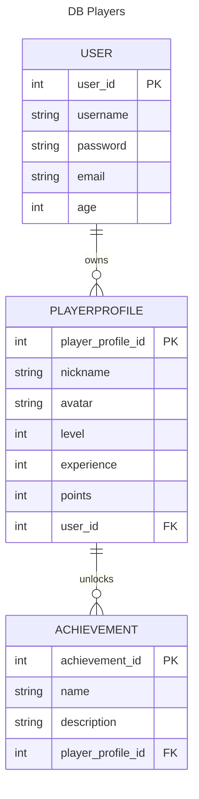
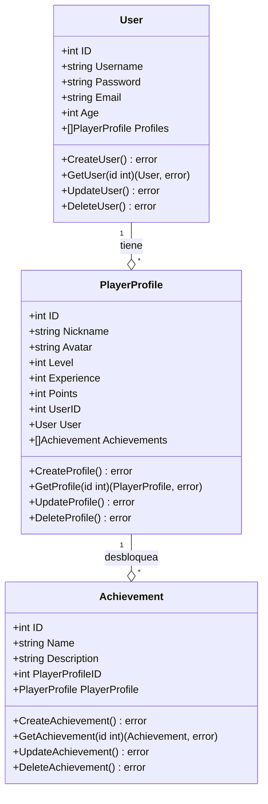
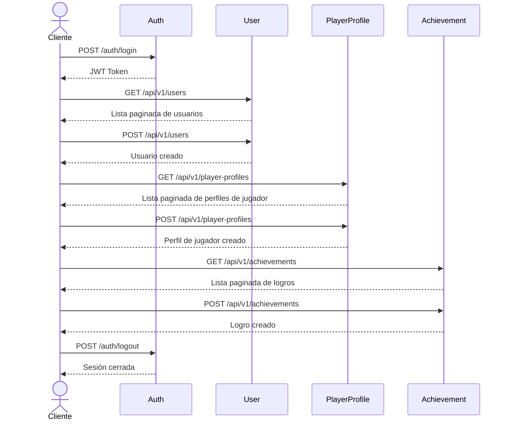
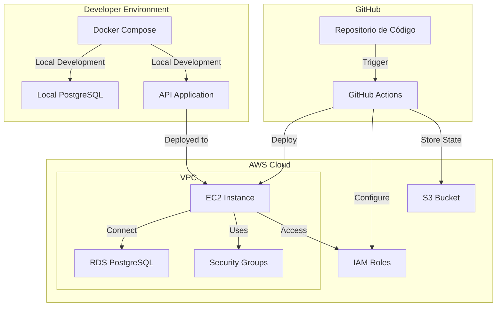

# Project 01 - Player profile

## Description

El proyecto consiste en una API REST que expone una base de datos que maneja 3 entidades:

- User
- PlayerProfile
- Achievement

Un Usuario puede tener varios PlayerProfiles y un PlayerProfile puede tener varios Achievements.

La relación sería la siguiente:	

## Tecnologías

- Golang 1.22.1
- Gin Gonic
- Gorm
- PostgreSQL
- Docker
- Docker Compose
- Makefile
- GitHub Actions
- Terraform
- AWS
- Swagger
- SonarCloud
- Synk

La aplicación consta de una API con los respectivos endpoints para cada entidad, como base de datos se utiliza PostgreSQL y se utiliza Docker Compose para levantar la base de datos y la aplicación. Se despliega mediante un Pipeline de GitHub Actions a un entorno de AWS utilizando Terraform.

## Diagrama de Clases

## Endpoints

### User

- **GET /users**: Devuelve todos los usuarios.
- **GET /users/{id}**: Devuelve un usuario por su id.
- **POST /users**: Crea un usuario.
- **PUT /users/{id}**: Actualiza un usuario por su id.

### PlayerProfile

- **GET /player-profiles**: Devuelve todos los perfiles de jugador.
- **GET /player-profiles/{id}**: Devuelve un perfil de jugador por su id.
- **POST /player-profiles**: Crea un perfil de jugador.
- **PUT /player-profiles/{id}**: Actualiza un perfil de jugador por su id.

### Achievement

- **GET /achievements**: Devuelve todos los logros.
- **GET /achievements/{id}**: Devuelve un logro por su id.
- **POST /achievements**: Crea un logro.
- **PUT /achievements/{id}**: Actualiza un logro por su id.

## Infraestructura de AWS

- **VPC**: Para la configuración de la red virtual privada interna de la aplicación.
- **EC2**: Para la creación de la instancia virtual que alojará la aplicación.
- **RDS**: Para la creación de la base de datos PostgreSQL.
- **Security Groups**: Para la configuración de los puertos de entrada y salida de la aplicación.
- **IAM**: Para la creación de los roles y permisos necesarios para la aplicación.
- **S3**: Para el almacenamiento de los archivos de configuración de Terraform.

## Diagrama de Arquitectura

