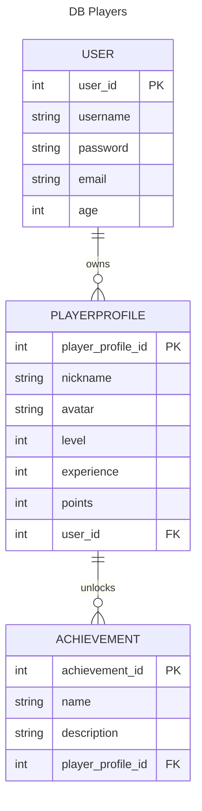
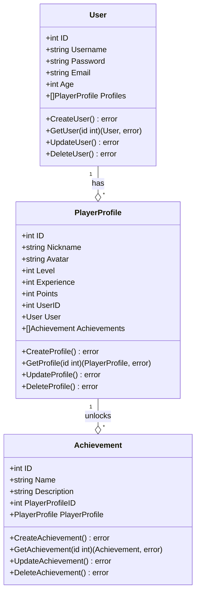
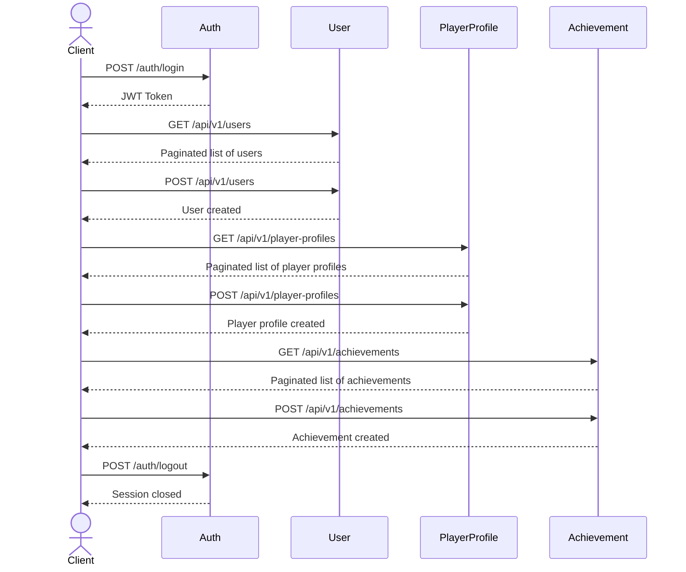
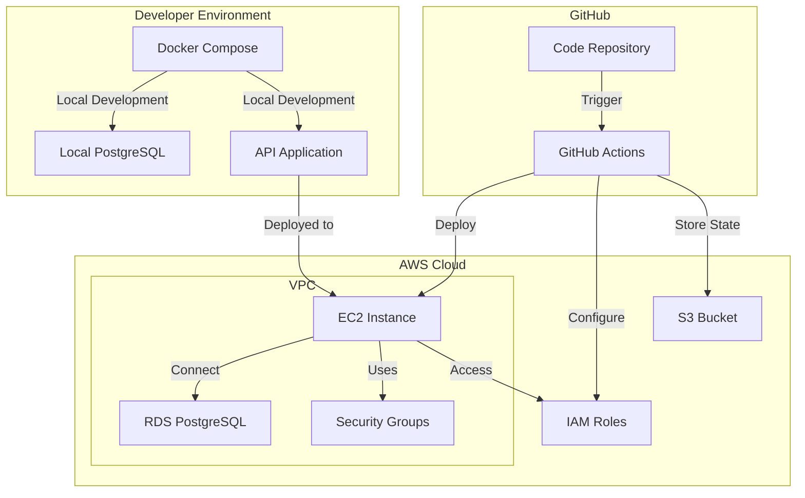

# Project 01 - Player Profile

## Description

The project consists of a REST API that exposes a database managing 3 entities:

- User
- PlayerProfile
- Achievement

A User can have multiple PlayerProfiles, and a PlayerProfile can have multiple Achievements.

The relationship would be as follows:

## Technologies

- Golang 1.22.1
- Gin Gonic
- Gorm
- PostgreSQL
- Docker
- Docker Compose
- Makefile
- GitHub Actions
- Terraform
- AWS
- Swagger
- SonarCloud
- Synk

The application consists of an API with respective endpoints for each entity. PostgreSQL is used as the database, and Docker Compose is used to set up both the database and the application. Deployment is handled via a GitHub Actions pipeline to an AWS environment using Terraform.

## Class Diagram

## Endpoints

### User

- **GET /users**: Returns all users.
- **GET /users/{id}**: Returns a user by their id.
- **POST /users**: Creates a user.
- **PUT /users/{id}**: Updates a user by their id.

### PlayerProfile

- **GET /player-profiles**: Returns all player profiles.
- **GET /player-profiles/{id}**: Returns a player profile by its id.
- **POST /player-profiles**: Creates a player profile.
- **PUT /player-profiles/{id}**: Updates a player profile by its id.

### Achievement

- **GET /achievements**: Returns all achievements.
- **GET /achievements/{id}**: Returns an achievement by its id.
- **POST /achievements**: Creates an achievement.
- **PUT /achievements/{id}**: Updates an achievement by its id.

## AWS Infrastructure

- **VPC**: For the internal virtual private network configuration of the application.
- **EC2**: For the creation of the virtual instance hosting the application.
- **RDS**: For the creation of the PostgreSQL database.
- **Security Groups**: For configuring the application’s inbound and outbound ports.
- **IAM**: For creating the necessary roles and permissions for the application.
- **S3**: For storing Terraform configuration files.

## Architecture Diagram

